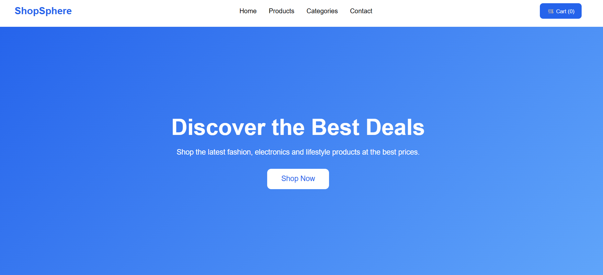
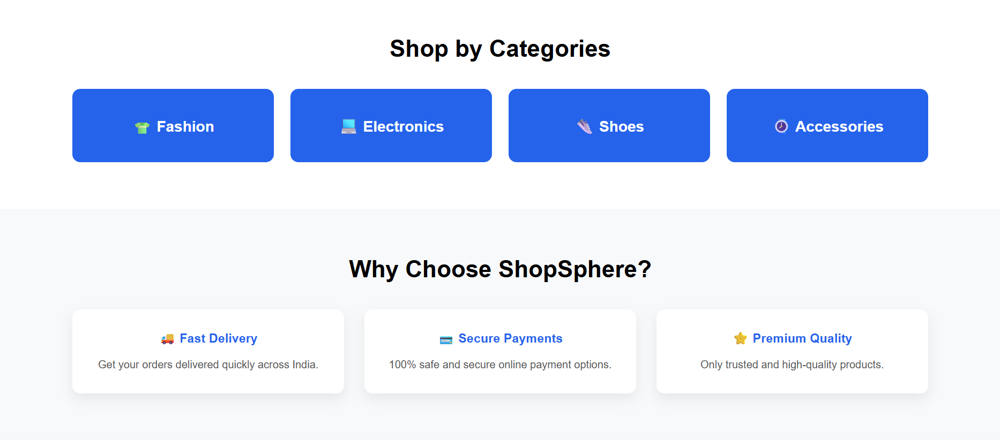
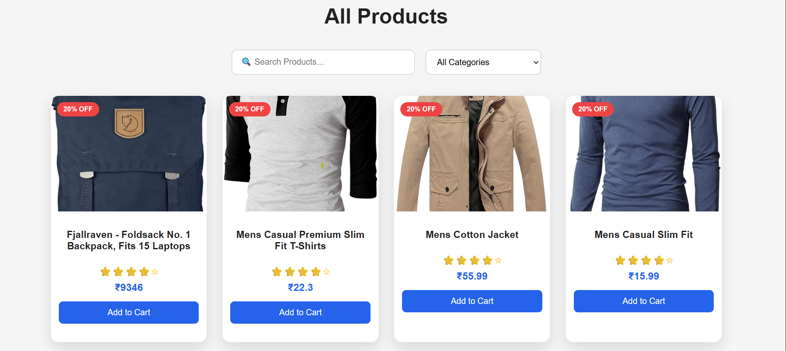

# ShopSphere

ShopSphere is a responsive e-commerce web application built with React. It enables users to browse products, search items, filter products by category, and manage a shopping cart with persistent local storage. Product data is fetched dynamically from the Fake Store API.

## Live Demo

**Website:** https://shop-sphere-git-main-sakshikdev1.vercel.app/

## Features

* Browse products from the Fake Store API
* Search products by name
* Filter products by category
* Add products to the shopping cart
* Increase and decrease product quantity
* Remove products from the cart
* Persist cart data using Local Storage
* Responsive design for desktop and mobile devices

## Technologies Used

* React.js
* JavaScript (ES6+)
* HTML5
* CSS3
* React Router
* React Context API
* Local Storage
* Fake Store API
* Git & GitHub
* Vercel

## Project Structure

```text
src/
├── components/
├── context/
├── pages/
├── services/
├── styles/
├── App.jsx
└── main.jsx
```

## Getting Started

Clone the repository:

```bash
git clone https://github.com/SakshiKdev/ShopSphere.git
```

Navigate to the project folder:

```bash
cd ShopSphere
```

Install dependencies:

```bash
npm install
```

Run the development server:

```bash
npm run dev
```

## Future Improvements

* Product Details page
* User Authentication
* Wishlist functionality
* Product sorting
* Checkout process
* Order history

## Author

**Sakshi Khakhal**

GitHub: https://github.com/SakshiKdev

## Screenshots

### Home Page

| Hero Section                          | Featured Products                              |
| ------------------------------------- | ---------------------------------------------- |
|  |  |

| Categories                                | Footer                            |
| ----------------------------------------- | --------------------------------- |
|  |  |

### Products Page



